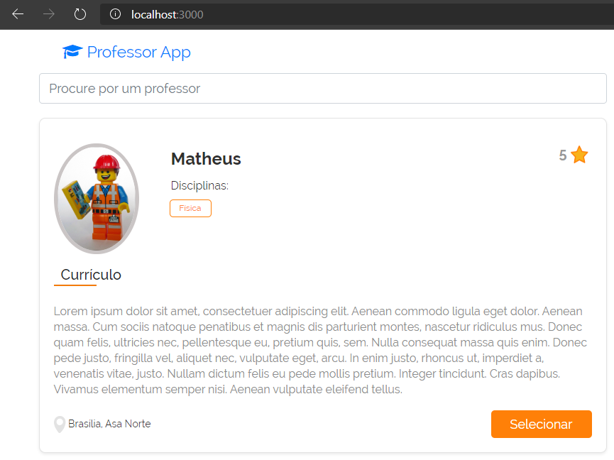

# Colmeia_Test_Frontend

## Passos para execução

### 1) Clonar repositório do projeto

```bash
$ git clone https://github.com/brunnooliver7/Colmeia_Test_Frontend
```
### 2) Instalar as dependências do **_frontend_**

```bash
frontend $ npm i
```

### 3) Executar o **_backend_** (https://github.com/brunnooliver7/Colmeia_Test_Backend)

```bash
backend $ npm start
```
### 4) Executar o **_frontend_**
```bash
frontend $ npm start
```

Se a aplicação executar de forma correta, você deve receber a seguinte resposta:

```bash
Compiled successfully!
```

### 5) Fazer pesquisas de professores
Acesse a URL: http://localhost:3000 e faça uso da aplicação

